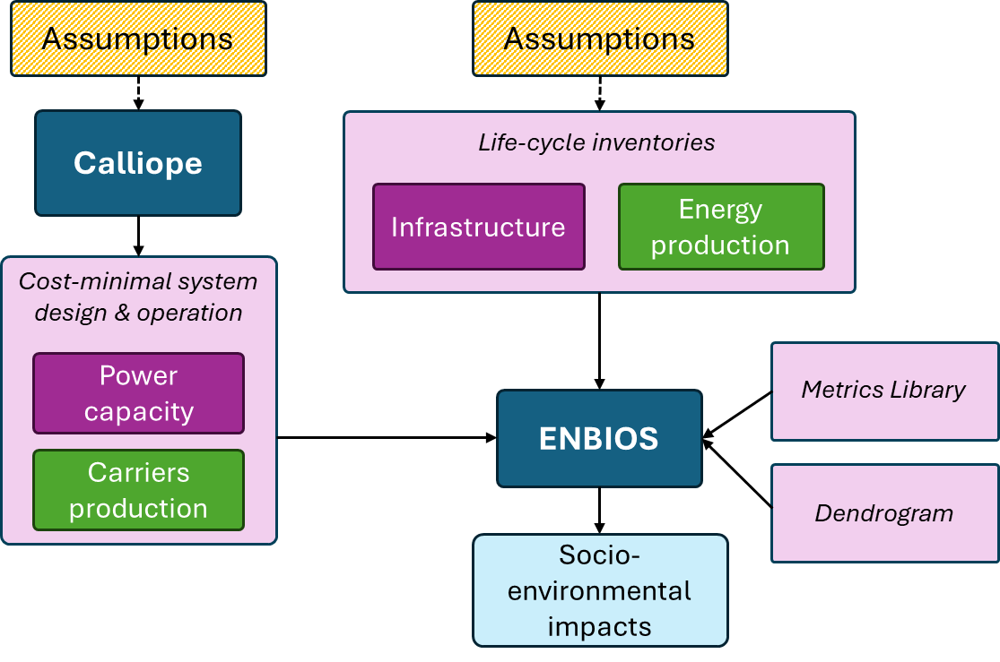

# Calliope-ENBIOS integration

## About
This repository provides a workflow to establish a soft coupling between ENBIOS and Calliope, ensuring alignment between 
their implicit and explicit assumptions. Calliope generates cost-optimal system designs for energy scenarios, while 
ENBIOS uses the resulting installed power capacity and energy carrier production across Europe (see Figure below). Additionally, 
ENBIOS incorporates life-cycle inventories for energy infrastructure and energy production 
(including operation and maintenance). This workflow ensures that these inventories are consistent with Calliope's 
assumptions.



## Workflow capabilities
### Update the background (sectors other than energy)
Calliope makes a few assumptions on the supply and demand of different economic sectors for 2050. This workflow allows 
adapting the corresponding life-cycle inventories accordingly, if desired:
- **Cement**: clinker production with Carbon Capture and Storage
- **Train**: 100% electrification
- **Biomass**: specified share (biomass_from_residues_share) coming from residues
- **Iron and steel**: from hydrogen - direct reduction iron - 50% electric arc furnace synthetic route
- **Plastics**: olefins produced by methanol. Methanol from H2 and CO2 (from Direct Air Capture)
- **Methanol**: Feedstock methanol from electrolysis (Note: aromatics follow today synthetic route due to lack of data.
            Calliope's assumptions on recycling and improved circular economies could not be matched.)
- **Ammonia**: Feedstock ammonia from hydrogen
- **Transport**: (1) Trucks improved efficiency to EURO6
             (2) Trucks fleet share electrified as specified (trucks_electrification_share)
             (3) Sea transport using synthetic diesel instead of heavy fuel oil

**IMPORTANT**: Note that the changes are only made for Europe, but the rest of the World keeps functioning with the same
production structure as today's.

Summary of LCA background adaptations for each sector:
| **Product/service** | **Description**                                                                                                          | **Inventory name**                                                                                                                  | **Source**                                     |
| ------------------- | ------------------------------------------------------------------------------------------------------------------------ | ----------------------------------------------------------------------------------------------------------------------------------- | ---------------------------------------------- |
| Cement              | Clinker production with on-site CCS                                                                                      | clinker production, efficient, with on-site CCS                                                                                     | Premise additional inventories                 |
| Iron/steel          | Hydrogen direct reduction iron plus electric arc furnace with 50% scrap steel                                            | ‘iron production, from DRI’; ‘steel production, electric, low-alloyed, from DRI-EAF’                                                | New inventory. From various sources            |
| Plastics (olefins)  | Hydrogen-methanol-olefins, which produces propylene, ethylene and butene                                                 | propylene/ethylene/butene production, from methanol (energy allocation)                                                             | From Chen et al. 2024                          |
| Methanol            | Via hydrogen from electrolysis and CO2 from DAC                                                                          | methanol distillation, hydrogen from electrolysis, CO2 from DAC                                                                     | Premise additional inventories                 |
| Ammonia             | Via hydrogen from electrolysis and CO2 from DAC                                                                          | ammonia production, hydrogen from electrolysis                                                                                      | Premise additional inventories                 |
| Kerosene            | No substitution                                                                                                          | No substitution                                                                                                                     | No substitution                                |
| Diesel              | From Fischer Tropsch synthesis via hydrogen from wood gasification                                                       | diesel production, synthetic, from Fischer Tropsch process, hydrogen from wood gasification, energy allocation, at fuelling station | Premise additional inventories                 |
| Biomass             | Biomass as fuel coming partially (share) from forest residues                                                            | market for biomass, used as fuel                                                                                                    | Adaptation from premise additional inventories |
| Sea transport       | Heavy fuel oil substituted by synthetic diesel                                                                           | ‘transport, freight, sea, ...’                                                                                                      | Adaptation from premise additional inventories |
| Road transport      | share (%) ICE– share (%) electric trucks. ICE trucks efficiency updated to EURO6. Diesel substituted by synthetic diesel | ‘transport, freight, lorry, battery electric, ...’                                                                                  | Adaptation from premise additional inventories |

The concept is exemplified with steel in the Figure below.


In code, update_background() is the function in charge of these adaptations. The assumptions can be implemented 
 separately by choosing the corresponding booleans in the function run(). Example of accepting all assumptions:
```ruby
run(ccs_clinker=True,
        train_electrification=True,
        biomass_from_residues=True, biomass_from_residues_share=1.0,
        h2_iron_and_steel=True,
        olefins_from_methanol=True,
        methanol_from_electrolysis=True,
        ammonia_from_hydrogen=True,
        trucks_electrification=True, trucks_electrification_share=0.5,
        sea_transport_syn_diesel=True)
```
Example of accepting only the assumption about train electrification, plus the assumption about biomass 
(with 50% of it coming from residues):
```ruby
run(ccs_clinker=False,
        train_electrification=True,
        biomass_from_residues=True, biomass_from_residues_share=0.5,
        h2_iron_and_steel=False,
        olefins_from_methanol=False,
        methanol_from_electrolysis=False,
        ammonia_from_hydrogen=False,
        trucks_electrification=False, trucks_electrification_share=0.5,
        sea_transport_syn_diesel=False)
```

### Adapt the foreground (energy sector inventories)
Each technology in Calliope is matched with an inventory via the file in folder data/input. 
Some of these technology inventories need adaptations to match Calliope's.
Moreover, we introduce the concept of technology fleets for solar photovoltaics, onshore and offshore wind energy, 
hydrogen, and chemical batteries. Example of the fleet concept applied to openground photovoltaics below:


In code, update_foreground() is the function in charge of these adaptations.

### Separate inventories into onsite and offsite
The workflow allows increasing the spatial resolution of the inventories by distinguishing between onsite 
(i.e., in the location where the energy is produced) and offsite (i.e., elsewhere in the value chain) flows. 
To do so, we separate the life-cycle phases according to where the emissions are happening. Onsite emissions are those 
direct emissions encompassed during the installation and operation and maintenance, whereas the infrastructure as well 
as the fuel and auxiliary materials needed during the operation and maintenance have associated emissions offsite. 

### Avoid double accounting
Previous studies coupling ESM and LCA highlight the importance of dealing with the double accounting problem 
(Reinert et al., 2021, Blanco et al., 2020, Vandepaert et al., 2020, Volkart et al., 2018, June et al., 2020, 
de Tomás et al., 2024, Sacchi and Menacho, 2024). This workflow allows to avoid double accounting by using the polluter
pays principle. 
There are two possible sources of double accounting. Let's break them down using electricity production as an example:
    1. Calliope calculates the demand for electricity in Europe. We will calculate the impacts of the technologies that
    produce electricity to satisfy this demand. Thus, when calculating the impacts of other technologies within the
    energy system (e.g., electricity used in electrolysers for hydrogen production), we should not count the
    impacts of this electricity again. (delete internal links)
    2. Calliope assumes electricity is produced with certain technologies. However, in Ecoinvent, other technologies
    might be producing electricity in the background (e.g., coal is not used in Calliope but is in the background of
    Ecoinvent). Thus, they should not be accounted for either. (delete links from shifted demand from Ecoinvent
    to Calliope)
The following energy carriers are dealt with: electricity, heat, CO2, hydrogen, waste, biomass, methane, methanol,
kerosene, diesel.